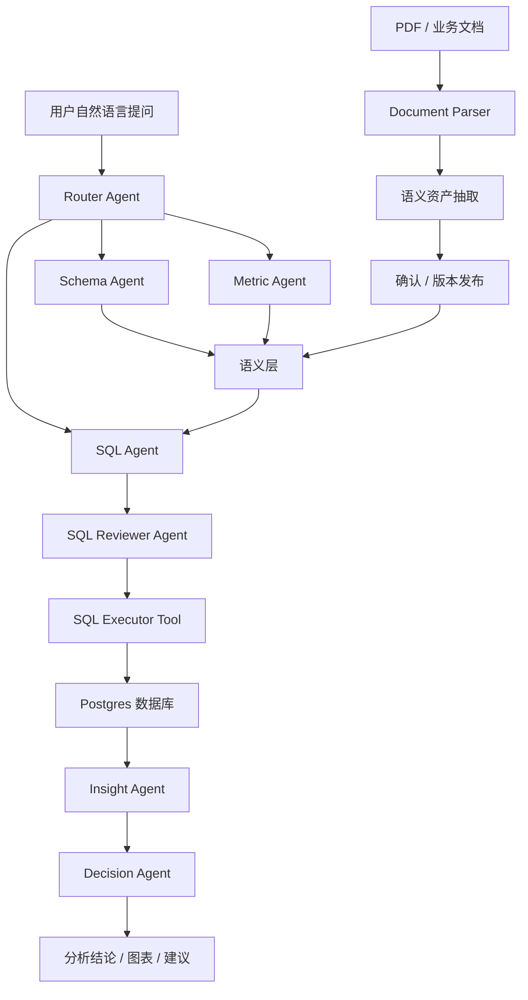

# 企业级数据智能分析与决策平台：产品定义

## 1. 产品定位

企业级数据智能分析与决策平台，是一个面向业务人员、数据分析师和管理者的 AI 数据分析系统。

它的核心目标不是做普通的 PDF 问答，也不是只做简单的 Text-to-SQL，而是让 AI 能够理解企业数据资产、指标口径、业务规则和用户问题，并通过多智能体协作完成数据查询、分析归因和决策建议。

一句话定义：

```text
基于语义层和 LangGraph 多智能体流程，构建一个支持自然语言问数、指标分析、SQL 生成审核、数据解释和决策建议的企业级数据智能平台。
```

前端类比：

```text
普通 Text-to-SQL 像直接根据用户输入拼接口参数。
本项目更像先读取 TypeScript 类型、接口文档、业务规则和权限配置，再决定调用哪个接口、传什么参数、如何展示结果。
```

---

## 2. 产品要解决的问题

企业数据分析里常见的问题：

- 业务人员不会写 SQL，依赖数据分析师取数。
- 同一个指标在不同团队里口径不一致。
- 数据表多、字段多，AI 容易选错表、写错 Join。
- 查询结果只有数字，缺少业务解释和行动建议。
- 传统 BI 更偏固定报表，临时追问和复杂归因不够灵活。
- 普通 RAG 只能回答文档内容，不能真正查询数据库验证。

本项目要解决的是：

```text
让用户用自然语言提出业务问题，
系统自动理解指标口径和数据结构，
生成安全可审核的 SQL，
查询真实数据库，
并输出有证据、有解释、有建议的分析结果。
```

---

## 3. 核心产品形态

用户看到的是一个智能数据分析助手。

用户可以问：

```text
最近几个月销售额趋势如何？
哪个品类 GMV 最高？
哪些卖家的履约表现最差？
低评分订单主要和什么因素有关？
华南地区销售下降可能是什么原因？
如果要提升家居品类销售，有什么建议？
```

系统返回的不只是自然语言回答，而是完整分析结果：

- 使用了哪些指标口径。
- 查询了哪些数据表。
- 生成并执行了什么 SQL。
- 查询结果是什么。
- 图表或表格展示。
- 主要结论。
- 可能原因。
- 改进建议。
- 数据来源和限制说明。

---

## 4. 核心能力边界

### 4.1 必选核心能力

这些是项目的主干。

- 多数据表导入与建模。
- 数据字典管理。
- 指标口径管理。
- 表关系与 Join 规则管理。
- 自然语言问题理解。
- Schema RAG / Metric RAG / SQL Template RAG。
- Text-to-SQL 生成。
- SQL 安全审核。
- SQL 执行与结果解析。
- 多智能体分析流程。
- 图表与分析报告生成。
- 会话历史与分析上下文管理。

### 4.2 可选增强能力

这些不是第一优先级，但可以作为项目亮点。

- PDF / Markdown / Excel 文档导入。
- 业务文档自动抽取语义资产。
- 人机协同确认指标口径。
- 经营复盘背景引用。
- 用户行为数据源接入。
- 漏斗分析与转化分析。
- LangSmith 观测与调试。
- 权限控制与审计日志。

---

## 5. 数据源设计

### 5.1 第一阶段：主数据源

第一阶段建议使用 Olist 电商数据作为主数据源。

它适合做：

- 订单分析。
- 商品分析。
- 支付分析。
- 物流分析。
- 评价分析。
- 卖家分析。
- 区域分析。

第一阶段目标不是做一个 Olist 专用 Demo，而是用 Olist 作为第一个数据源，验证完整的数据智能分析平台链路。

```text
Olist 是第一个接入的数据源，不是系统本身。
```

### 5.2 第二阶段：同源扩展数据源

第二阶段可以优先接入 Olist Marketing Funnel。

它可以和 Olist 主数据通过 `seller_id` 建立真实关联，更适合展示：

- 卖家线索分析。
- 卖家转化漏斗。
- 营销线索质量。
- 卖家入驻后的成交表现。

### 5.3 第三阶段：异源行为数据

后续可以接入 Multi-Category Behavior 这类用户行为数据。

它适合展示：

- 浏览行为。
- 加购行为。
- 购买行为。
- 漏斗分析。
- 转化率分析。
- 用户路径分析。

但它和 Olist 不是同一个网站，不能直接用用户 ID 或商品 ID 硬 Join。

更合理的方式是：

- 按日期聚合。
- 按品类映射。
- 按指标层统一。
- 作为独立行为分析域接入平台。

---

## 6. PDF 在项目中的正确定位

PDF 上传不是本项目的核心主线，也不是必选功能。

如果做 PDF，不能只做普通文档问答，而应该做成：

```text
Document-to-Semantic-Layer
```

也就是：

```text
PDF / 业务文档
-> 自动抽取指标口径、字段说明、业务规则、SQL 示例、经营事件
-> 进入待确认语义资产
-> 发布到语义层
-> 影响 Text-to-SQL 和数据分析
```

PDF 的价值不是让用户问“这个 PDF 说了什么”，而是让业务文档变成 AI 数据分析可以使用的语义资产。

可以支持的文档类型：

- 数据字典文档。
- 指标口径说明。
- 经营复盘报告。
- 促销活动日历。
- 区域运营事件记录。
- 数据质量说明。
- 历史 SQL 或 BI 报表说明。

### 6.1 为什么需要确认流程

从 PDF 抽取出的内容可能会影响 SQL 和分析结论。

例如：

```text
GMV 是否包含取消订单？
延迟率如何计算？
订单表和支付表如何 Join？
```

这些内容如果自动生效并且出错，会导致整个分析结果错误。

因此更合理的设计是：

```text
AI 自动抽取
-> 生成语义资产草稿
-> 根据风险等级自动入库或等待确认
-> 版本化发布
-> Agent 检索使用
```

低风险内容可以自动入库：

- 字段别名。
- 字段描述。
- 业务同义词。
- 普通背景事件。

高风险内容需要确认：

- 指标公式。
- Join 规则。
- SQL 模板。
- 权限规则。
- 数据过滤条件。

这不是不智能，而是企业级系统需要可信、可控、可审计。

---

## 7. 语义层是项目核心

本项目最重要的中间层是语义层。

语义层负责把数据库里的物理结构，转换成 AI 和业务人员都能理解的业务知识。

语义层应该包含：

- `data_sources`：数据源定义。
- `data_assets`：表和字段资产。
- `metric_definitions`：指标定义。
- `join_rules`：表关系和 Join 规则。
- `sql_templates`：经过验证的 SQL 示例。
- `business_rules`：业务规则和数据质量说明。
- `business_events`：经营事件和历史复盘线索。

没有语义层时：

```text
用户问题 -> LLM 猜表 -> LLM 猜字段 -> LLM 猜 SQL
```

有语义层时：

```text
用户问题 -> 检索语义资产 -> 构建 SQL 上下文 -> 生成 SQL -> 审核 -> 执行 -> 分析
```

---

## 8. 多智能体职责设计

本项目中的多智能体不是简单地多写几个节点，而是让不同 Agent 承担不同职责。

推荐拆分：

- `Router Agent`：判断用户问题类型，是问数、归因、报告、图表还是闲聊。
- `Schema Agent`：检索相关表、字段、Join 规则。
- `Metric Agent`：检索指标口径和计算规则。
- `SQL Agent`：生成 SQL。
- `SQL Reviewer Agent`：审核 SQL 安全性、表关系和指标口径。
- `Executor Tool`：执行 SQL。
- `Insight Agent`：解释查询结果，提炼结论。
- `Decision Agent`：生成业务建议。
- `Visualization Agent`：选择合适图表类型并生成图表配置。

前端类比：

```text
Router Agent 像路由层。
Schema / Metric Agent 像接口文档和类型系统查询层。
SQL Agent 像请求参数构建器。
Reviewer Agent 像 ESLint + Code Review。
Executor Tool 像真正发请求的 API Client。
Insight / Decision Agent 像页面业务逻辑和结果渲染层。
```

---

## 9. 推荐阶段规划

### 9.1 第一阶段：语义层驱动的 Text-to-SQL 数据分析

目标：

```text
完成从自然语言问题到 SQL 查询、数据结果、分析结论的闭环。
```

核心内容：

- Olist 数据导入 Postgres。
- 建立数据字典。
- 建立指标口径。
- 建立 Join 规则。
- 建立 SQL 示例。
- 实现 Schema RAG 和 Metric RAG。
- 实现 SQL 生成和审核。
- 实现查询执行。
- 实现分析报告输出。

这一阶段就可以作为完整简历项目。

### 9.2 第二阶段：同源营销漏斗扩展

目标：

```text
接入 Olist Marketing Funnel，展示跨业务域分析能力。
```

核心内容：

- 接入营销线索数据。
- 通过 `seller_id` 和订单数据关联。
- 分析线索质量、卖家转化、卖家成交表现。
- 增加 Funnel Agent 或 Growth Agent。

### 9.3 第三阶段：异源行为数据扩展

目标：

```text
展示多源数据接入和行为分析能力。
```

核心内容：

- 接入用户行为事件数据。
- 建立事件模型。
- 建立品类映射。
- 做浏览、加购、购买漏斗。
- 做转化率和路径分析。
- 增加 Behavior Agent。

### 9.4 第四阶段：文档驱动语义层增强

目标：

```text
把 PDF / Markdown / Excel 等业务文档转成语义层资产。
```

核心内容：

- 文档上传。
- 文档解析。
- 语义资产抽取。
- 风险分级。
- 人机协同确认。
- 版本化发布。
- 影响 Text-to-SQL 和分析结论。

---

## 10. 产品流程图



---

## 11. 项目不应该做成什么

不建议做成：

```text
上传 PDF -> 向量化 -> 问答
```

这会显得像普通知识库项目，和“数据智能分析与决策平台”的定位不匹配。

也不建议做成：

```text
用户问题 -> LLM 直接生成 SQL -> 执行
```

这会缺少企业级系统最关键的指标口径、语义层、审核、治理和可追溯能力。

更推荐做成：

```text
数据源接入
-> 语义层建设
-> Agent 检索语义资产
-> 生成并审核 SQL
-> 查询数据库
-> 解释结果
-> 输出决策建议
```

---

## 12. 简历描述建议

可以这样描述：

```text
设计并实现企业级数据智能分析与决策平台，基于 LangGraph 构建多智能体数据分析流程，支持自然语言问数、Schema RAG、Metric RAG、Text-to-SQL、SQL 安全审核、PostgreSQL 查询执行和分析报告生成。
```

增强版描述：

```text
实现 Document-to-Semantic-Layer 能力，支持从业务文档中自动抽取指标口径、字段说明、Join 规则和 SQL 模板，经风险分级与人机协同确认后沉淀到语义层，用于约束 Text-to-SQL 生成并提升数据分析可信度。
```

完整项目描述：

```text
项目以 Olist 电商数据为主数据源，构建统一语义层和指标体系，通过 LangGraph 编排 Router、Schema、Metric、SQL、Reviewer、Insight、Decision 等多个 Agent，实现从自然语言业务问题到 SQL 查询、数据解释、图表展示和决策建议的完整闭环。
```
