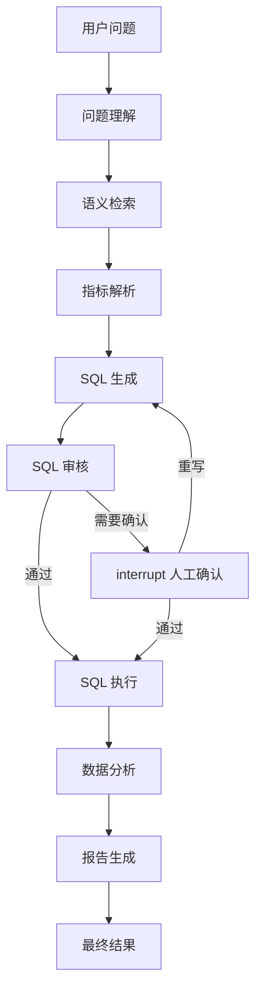
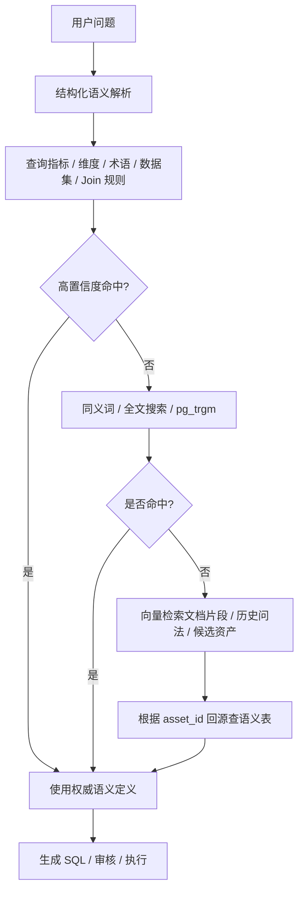
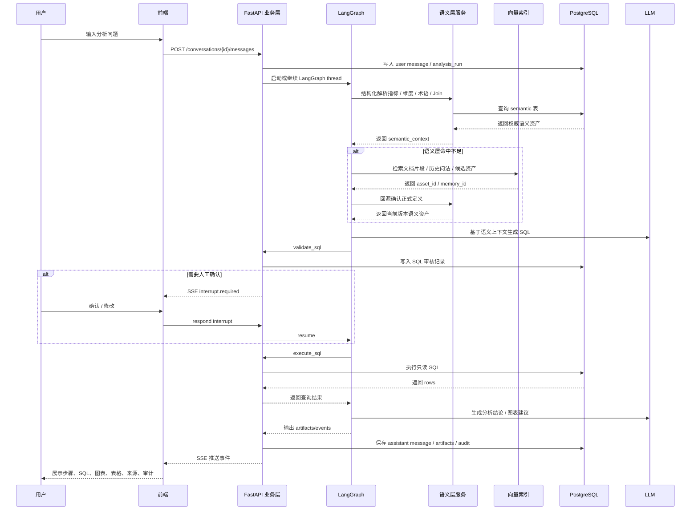
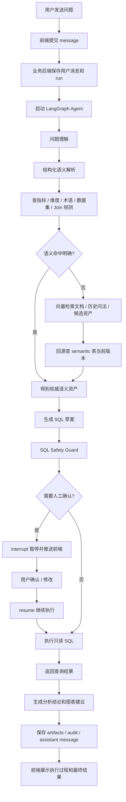

# 企业级数据智能分析与决策平台：技术架构方案

## 1. 文档说明

本文档根据当前 UI 方向重新整理技术方案。

参考图位于：

```text
design/ui/01_new_conversation.png
design/ui/02_conversation_detail.png
design/ui/03_execution_sql.png
design/ui/04_execution_sources.png
design/ui/05_execution_audit.png
design/ui/06_semantic_metrics.png
design/ui/07_semantic_dimensions.png
design/ui/08_semantic_datasets.png
design/ui/09_semantic_terms.png
```

注意：

```text
图片里的字段只作为 UI 方向参考。
最终字段以真实数据库、语义层设计、接口协议和业务规则为准。
```

这版方案的重点不是做一个普通聊天机器人，而是做一个“AI 数据分析工作台”：

```text
自然语言提问
-> Agent 执行多步骤分析
-> 生成并审核 SQL
-> 查询真实 PostgreSQL 数据
-> 输出指标卡、图表、表格、结论、来源和审计记录
```

前端类比：

```text
普通聊天机器人像一个 textarea + message list。
这个项目更像一个数据分析 IDE：
左侧是项目和历史会话，
中间是运行结果，
右侧是执行调试面板，
语义资产像 TypeScript 类型和 API schema，约束 Agent 怎么生成 SQL。
```

## 2. 第一阶段产品边界

### 2.1 第一阶段做什么

第一阶段聚焦一条完整链路：

```text
固定 Olist Ecommerce 数据源
-> 新建分析会话
-> 用户自然语言提问
-> LangGraph Agent 执行
-> SQL 生成与安全审核
-> 查询 PostgreSQL
-> 前端展示结果、来源、审计
-> 语义资产支撑 Text-to-SQL
```

第一阶段必须完成：

- 新建会话页。
- 新建会话页支持上传指标口径文档和业务语义文档。
- AI 从上传文档中提取候选指标、业务术语、维度说明和业务规则。
- 用户可以审核候选语义资产，决定采用、修改后采用或驳回。
- 历史会话详情页。
- Agent 执行步骤时间线。
- 右侧执行详情抽屉：`Steps`、`SQL`、`Sources`、`Audit`。
- 语义资产：指标、维度、数据集、业务术语。
- 固定数据源：`Olist Ecommerce / PostgreSQL`。
- 一个可跑通的问题，例如：`本月商品销售趋势分析` 或 `哪个品类销售额最高？`

### 2.2 第一阶段不做什么

第一阶段暂不做：

- 上传新的结构化数据集。
- 多租户和复杂权限。
- 完整 BI 报表编辑器。
- 多数据源 Join。
- 完整审批流引擎。
- 生产级任务队列。
- 复杂指标版本发布系统。

新建会话页可以提供“导入指标口径文档 / 导入业务语义文档”的入口，但它不是新增数据源。

它的定位是：

```text
Document-to-Semantic-Layer
文档 -> AI 提取候选语义资产 -> 人工审核 -> 发布到语义层
```

第一阶段推荐支持两种采用范围：

```text
采用到本次会话：只影响当前 conversation / thread 的分析上下文。
发布到全局语义层：写入正式 semantic 表，后续所有会话可用。
```

前端类比：

```text
采用到本次会话像给当前页面传入临时 props。
发布到全局语义层像把配置合并进全局 store / shared config。
```

## 3. 总体架构

```text
前端层 Next.js / React
        |
        | REST / SSE
        v
业务层 FastAPI
        |
        | 调用 Agent / 执行 SQL / 管理业务表
        v
AI 分析层 LangGraph
        |
        | 读取语义资产 / 调用模型 / 调用工具
        v
PostgreSQL
```

四层职责：

| 层级 | 主要职责 |
| --- | --- |
| 前端层 | 页面交互、会话 UI、流式状态、图表表格、执行详情、人工确认 |
| 业务层 | 用户、会话、消息、分析任务、语义资产、SQL 安全边界、审计、API |
| AI 分析层 | LangGraph 多节点流程、问题理解、结构化语义解析、低置信度向量召回、SQL 规划、结果分析 |
| 数据层 | Olist 业务数据、业务系统表、语义资产表、LangGraph checkpoint/store |

架构关键点：

- 前端不直接连数据库。
- 前端不直接调用大模型。
- 前端不直接判断 SQL 是否安全。
- LangGraph 不直接充当业务会话系统。
- `conversations/messages` 和 LangGraph `checkpoint` 必须分开。

前端类比：

```text
conversations/messages 像页面状态和业务数据。
LangGraph checkpoint 像运行时内部快照，主要用于恢复执行，不适合作为左侧聊天列表。
```

### 3.1 参考产品和设计取向

当前设计参考的不是普通 RAG 聊天，而是“语义层驱动的数据分析产品”。

可参考的真实方案：

| 产品 / 方案 | 可借鉴点 |
| --- | --- |
| dbt Semantic Layer / MetricFlow | 通过受治理的 semantic model 和 metrics 生成 SQL，指标口径是主入口 |
| Cube Semantic Layer | AI Agent 不直接查询数仓，而是通过语义层和 Semantic SQL 访问受控模型 |
| Looker / LookML | 用维度、指标、Join、关系建模，让用户和系统基于模型生成查询 |
| Power BI Copilot + Semantic Model | Copilot 围绕 semantic model 工作，依赖字段、measure、说明和模型准备质量 |
| ThoughtSpot Spotter | 自然语言先映射到受治理的语义 token，再基于语义层生成可验证分析 |

参考链接：

- [dbt Semantic Layer](https://docs.getdbt.com/docs/use-dbt-semantic-layer/dbt-sl)
- [Cube Documentation: Introduction](https://docs.cube.dev/docs/introduction)
- [Looker: Introduction to LookML](https://docs.cloud.google.com/looker/docs/what-is-lookml)
- [Power BI Copilot overview](https://learn.microsoft.com/en-us/power-bi/create-reports/copilot-introduction)
- [ThoughtSpot Spotter](https://www.thoughtspot.com/product/agents/spotter)

因此本项目的原则是：

```text
结构化语义层是主流程。
向量检索是增强能力，不是第一入口。
Agent 不能绕过语义层直接拼 SQL 查原始表。
```

前端类比：

```text
语义层像前端里的 route config、API schema、design tokens。
向量索引像搜索索引。
能通过明确配置命中的内容，不需要先走搜索。
```

## 4. 前端技术方案

### 4.1 前端技术栈

推荐：

- Next.js：应用框架和路由。
- React：页面与组件。
- TypeScript：前后端契约类型。
- assistant-ui：会话输入、消息流、thread/runtime 能力。
- ECharts 或 Recharts：图表。
- TanStack Query：普通 REST 请求状态。
- SSE：Agent 执行事件流。
- 自定义组件：分析画布、执行详情、SQL 面板、语义资产管理页。

### 4.2 assistant-ui 的使用边界

可以使用 assistant-ui，但不要让它包办整个系统。

适合交给 assistant-ui 的部分：

- 新建会话输入框。
- 用户消息和 AI 消息。
- thread / message runtime。
- 流式输出。
- 停止生成、重新生成。
- 工具调用的基础展示。

必须自定义的部分：

- 指标卡。
- 图表。
- 查询结果表格。
- Agent 步骤时间线。
- 执行详情抽屉。
- SQL 审核结果。
- Sources 来源列表。
- Audit 审计记录。
- 语义资产四个管理页。

推荐前端结构：

```text
app/
  analysis/
    new/page.tsx
    [conversationId]/page.tsx
  semantic/
    metrics/page.tsx
    dimensions/page.tsx
    datasets/page.tsx
    terms/page.tsx

components/
  app-shell/
  conversation/
  analysis-canvas/
  execution-drawer/
  semantic-assets/
  charts/
  tables/
```

前端类比：

```text
assistant-ui 像专门负责聊天运行态的组件和状态层。
语义资产、图表、SQL 面板仍然是普通业务组件。
不要把整个后台管理系统都塞进 Thread 组件里。
```

### 4.3 页面结构

第一阶段页面：

| 页面 | 路由建议 | 作用 |
| --- | --- | --- |
| 新建会话 | `/analysis/new` | 用户选择固定数据源、上传语义文档、审核候选资产并输入自然语言问题 |
| 会话详情 | `/analysis/[conversationId]` | 展示分析进度、图表、表格、结论 |
| 执行详情 | 详情页右侧抽屉 | 查看 Steps、SQL、Sources、Audit |
| 指标管理 | `/semantic/metrics` | 管理“算什么” |
| 维度管理 | `/semantic/dimensions` | 管理“按什么分析” |
| 数据集说明 | `/semantic/datasets` | 管理“从哪里查、怎么 Join、能不能查” |
| 业务术语 | `/semantic/terms` | 管理“用户说法如何映射到标准资产” |

全局布局：

```text
左侧导航
-> 会话记录
-> 数据源
-> 语义资产

顶部栏
-> 帮助中心
-> 通知
-> 用户菜单

主区域
-> 根据路由渲染分析页或语义资产页
```

### 4.4 新建会话的语义准备区

新建会话页建议分成三块：

```text
固定数据源
-> 语义准备区
-> 问题输入区
```

语义准备区支持两类上传：

| 上传类型 | 用途 | AI 提取内容 |
| --- | --- | --- |
| 指标口径文档 | 说明销售额、订单数、退款率等指标怎么算 | 候选指标、SQL 表达式、依赖表、可用维度、同义词 |
| 业务语义文档 | 说明业务术语、分组规则、分析规则 | 候选业务术语、维度别名、分组规则、业务规则 |

用户审核候选资产时有三种操作：

| 操作 | 含义 |
| --- | --- |
| 采用 | 不修改，直接进入当前会话语义上下文 |
| 修改后采用 | 先编辑名称、定义、SQL、映射目标等，再进入当前会话语义上下文 |
| 驳回 | 不进入当前会话，也不发布 |

采用后再分两种范围：

```text
本次会话采用：写入 app.conversation_semantic_assets。
全局发布：写入 semantic.metrics / semantic.dimensions / semantic.business_terms 等正式表。
```

第一阶段建议默认走“本次会话采用”，全局发布可以作为高级按钮。

这样做的原因：

```text
指标口径和业务术语会影响 SQL 生成。
如果 AI 提取错误并直接全局生效，会污染后续所有分析。
```

## 5. 业务层技术方案

### 5.1 业务层定位

业务层是正式系统边界，建议使用 FastAPI。

它负责：

- 用户和角色。
- 会话列表。
- 消息记录。
- 分析任务。
- Agent 执行事件转发。
- Artifact 保存。
- 语义资产管理。
- SQL 安全审核。
- SQL 执行。
- 审计日志。
- 文档导入与语义资产草稿。

### 5.2 核心业务表

建议第一阶段使用这些业务表：

| 表 | 作用 |
| --- | --- |
| `app.users` | 用户信息 |
| `app.conversations` | 左侧会话列表 |
| `app.messages` | 前端展示级消息 |
| `app.analysis_runs` | 一次用户提问对应一次分析任务 |
| `app.analysis_steps` | Agent 执行步骤记录 |
| `app.analysis_artifacts` | SQL、表格、图表、报告、来源等结构化产物 |
| `app.audit_logs` | SQL 审核、用户确认、Agent 执行记录 |
| `app.conversation_semantic_assets` | 当前会话采用的临时语义资产 |
| `semantic.metrics` | 指标定义 |
| `semantic.dimensions` | 维度定义 |
| `semantic.datasets` | 数据表、字段、Join 路径和查询规则 |
| `semantic.business_terms` | 业务术语、同义词、分组规则 |
| `semantic.semantic_drafts` | 文档提取出的候选语义资产 |
| `corpus.documents` | 上传的指标口径或业务文档 |
| `corpus.document_chunks` | 文档解析后的 chunk |
| `vector.semantic_asset_embeddings` | 企业语义资产和文档片段的向量索引 |
| `vector.user_memory_embeddings` | 用户长期记忆的向量索引 |
| `vector.embedding_jobs` | 向量同步任务，支持异步重试、手动重建和定时全量刷新 |

### 5.3 数据库 schema 分层

推荐：

| Schema | 作用 |
| --- | --- |
| `olist` | Olist 业务数据源 |
| `app` | 会话、消息、分析任务、artifact |
| `semantic` | 指标、维度、数据集、业务术语 |
| `corpus` | 文档和切块 |
| `vector` | 向量索引，包含语义资产索引和用户记忆索引 |
| `langgraph` | checkpoint / store |
| `audit` | 审计日志，也可以先放在 `app.audit_logs` |

第一阶段可以简化：

```text
先使用 app + semantic + olist 三类核心 schema。
langgraph checkpoint 可以使用 LangGraph 默认 Postgres 表。
```

### 5.4 API 模块

第一阶段 API 分组：

| 模块 | 示例接口 |
| --- | --- |
| App Bootstrap | `GET /api/app/bootstrap` |
| Conversation | `GET /api/conversations`、`POST /api/conversations` |
| Message | `GET /api/conversations/{id}/messages` |
| Analysis Run | `POST /api/conversations/{id}/analysis-runs`、`GET /api/analysis-runs/{id}/events` |
| Artifact | `GET /api/analysis-runs/{id}/artifacts` |
| Interrupt | `POST /api/analysis-runs/{id}/interrupts/{interrupt_id}/respond` |
| Semantic Metrics | `GET /api/semantic/metrics`、`POST /api/semantic/metrics` |
| Semantic Dimensions | `GET /api/semantic/dimensions` |
| Semantic Datasets | `GET /api/semantic/datasets` |
| Semantic Terms | `GET /api/semantic/terms` |
| Document Import | `POST /api/corpus/documents`、`POST /api/corpus/documents/{id}/extract-semantic-assets` |
| Semantic Draft Review | `GET /api/semantic/drafts`、`PATCH /api/semantic/drafts/{id}`、`POST /api/semantic/drafts/{id}/adopt`、`POST /api/semantic/drafts/{id}/publish` |
| Vector Index | `POST /api/vector/rebuild`、`POST /api/vector/assets/{asset_type}/{asset_id}/sync`、`GET /api/vector/jobs` |

## 6. AI 分析层技术方案

### 6.1 LangGraph 主流程

当前 UI 里的 Agent 执行进度建议对应下面的 LangGraph 节点：



节点职责：

| 节点 | 作用 | 主要输出 |
| --- | --- | --- |
| 问题理解 | 识别用户意图、时间范围、分析对象 | intent |
| 语义检索 | 检索相关指标、维度、数据集、业务术语 | semantic_context |
| 指标解析 | 确定使用哪个正式指标和维度 | metric_bindings |
| SQL 生成 | 基于语义上下文生成 SQL | sql |
| SQL 审核 | 只读检查、权限检查、LIMIT、敏感字段、大表扫描风险 | sql_review |
| SQL 执行 | 调用业务层安全执行 SQL | query_result |
| 数据分析 | 对结果进行解释、对比、归因 | insights |
| 报告生成 | 生成最终结论、来源、限制说明 | report |

### 6.2 Graph State

建议最小状态：

```python
class AnalysisState(TypedDict):
    messages: list
    question: str
    conversation_id: str
    run_id: str
    data_source_id: str
    intent: dict
    semantic_context: dict
    metric_bindings: dict
    sql: str
    sql_review: dict
    query_result: dict
    chart_spec: dict
    report: dict
    sources: dict
    audit: list[dict]
    error: str | None
```

### 6.3 工具设计

LangGraph 节点通过工具访问业务层能力：

| 工具 | 作用 |
| --- | --- |
| `search_metrics` | 检索指标 |
| `search_dimensions` | 检索维度 |
| `search_datasets` | 检索表、字段、Join 路径 |
| `search_terms` | 检索业务术语和同义词 |
| `search_semantic_assets_vector` | 低置信度时检索语义资产、文档片段、历史问法 |
| `search_user_memory` | 检索用户长期偏好和历史关注点 |
| `validate_sql` | SQL 安全审核 |
| `execute_sql` | 执行只读 SQL |
| `create_artifact` | 保存 SQL、图表、表格、报告 |
| `write_audit_log` | 写入审计记录 |
| `extract_semantic_candidates` | 从文档中抽取候选语义资产 |
| `load_conversation_semantics` | 读取当前会话采用的临时语义资产 |

### 6.4 流式事件

前端通过 SSE 消费事件。

核心事件：

- `run.started`
- `step.started`
- `step.completed`
- `progress.message`
- `sql.generated`
- `sql.reviewed`
- `artifact.created`
- `sources.created`
- `audit.created`
- `interrupt.required`
- `message.delta`
- `run.completed`
- `run.failed`

UI 图片里的右侧执行详情，其实就是这些事件的结构化展示。

### 6.5 语义解析与向量检索策略

真实数据分析产品通常不是“用户问题 -> 先查向量库 -> 再查语义表”。

更合理的顺序是：

```text
1. 先查结构化语义层：指标、维度、业务术语、数据集、Join 规则。
2. 如果高置信度命中，直接使用权威语义定义。
3. 如果命中不足，再使用同义词、全文搜索、pg_trgm 等模糊匹配。
4. 仍然不明确时，才使用向量检索召回文档片段、历史问法和候选资产。
5. 向量检索命中后，必须根据 asset_id 回源查询正式语义表。
```

流程图：



这样设计的原因：

```text
业务术语、指标、维度已经是结构化资产，能精确命中时不要绕远路。
向量库解决的是自然语言表达不标准、文档内容较长、同义词覆盖不完整的问题。
向量库不是另一套语义资产表，而是语义资产和文档内容的搜索索引。
```

## 7. 语义资产设计

语义资产是本项目的核心竞争力之一。

它解决的问题是：

```text
用户说的是业务语言，
数据库里是表名和字段名，
Agent 需要一层稳定映射，才能可靠生成 SQL。
```

### 7.1 指标

指标回答：

```text
算什么？
```

第一阶段指标：

- 销售额。
- 订单数。
- 客单价。
- 退款率。

指标来源：

```text
指标口径文档导入
-> AI 提取候选指标
-> 人工审核修改
-> 发布后 Agent 才能使用
```

如果是在新建会话页上传指标口径，推荐流程是：

```text
上传指标口径文档
-> AI 提取候选指标
-> 用户审核候选指标
-> 采用到本次会话
-> Agent 在本次分析中优先使用这些候选指标
-> 用户确认质量后再发布到全局语义层
```

优先级：

```text
本次会话采用的指标
> 全局已发布指标
> AI 临时理解
```

指标字段建议：

| 字段 | 说明 |
| --- | --- |
| `id` | 指标 ID，例如 `sales_amount` |
| `name` | 中文名称 |
| `description` | 业务定义 |
| `sql_expression` | SQL 表达式 |
| `depends_on_tables` | 依赖表 |
| `time_field` | 默认时间字段 |
| `available_dimensions` | 可用维度 |
| `synonyms` | 同义词 |
| `status` | draft / pending_review / published / disabled |
| `source_type` | manual / document / ai_candidate |

### 7.2 维度

维度回答：

```text
按什么分组、筛选、对比？
```

第一阶段维度：

- 品类。
- 客户地区。
- 下单时间。
- 支付方式。
- 订单状态。
- 卖家地区。

维度来源：

```text
数据库 schema 扫描
-> AI 生成中文名称和解释
-> 人工确认
-> 发布
```

维度字段建议：

| 字段 | 说明 |
| --- | --- |
| `id` | 维度 ID |
| `name` | 中文名称 |
| `field_path` | 字段映射，例如 `customers.customer_state` |
| `dataset_id` | 所属数据集 |
| `dimension_type` | category / geo / time / status |
| `available_metrics` | 可关联指标 |
| `synonyms` | 同义词 |
| `default_filters` | 常用过滤 |
| `status` | 状态 |

### 7.3 数据集

数据集回答：

```text
从哪里查？表怎么关联？Agent 能不能查？
```

第一阶段数据集就是 Olist 的表资产。

数据集管理不是普通数据库浏览器，它要服务 Text-to-SQL。

重点记录：

- 表名。
- 中文说明。
- 主键。
- 核心字段。
- 常用 Join 路径。
- 默认时间字段。
- 是否允许 Agent 查询。
- 查询规则。

Agent 查询规则：

- 只允许 `SELECT`。
- 默认 `LIMIT 100` 或 `LIMIT 1000`。
- 禁止 `DDL / DML`。
- 禁止敏感字段。
- 必须通过 SQL Safety Guard。

### 7.4 业务术语

业务术语回答：

```text
用户说的话如何映射到标准资产？
```

示例：

```text
GMV -> 销售额
成交额 -> 销售额
商品类型 -> 品类
高价值客户 -> 客户分层规则
重点地区 -> 地区分组规则
```

如果是在新建会话页上传业务语义文档，推荐流程是：

```text
上传业务语义文档
-> AI 提取候选术语、别名、分组规则、业务规则
-> 用户审核是否采用
-> 需要时编辑映射目标或规则内容
-> 采用到本次会话或发布到全局语义层
```

业务语义文档适合包含：

- 指标别名，例如 `GMV`、`成交额`、`销售金额`。
- 维度别名，例如 `商品类型` 映射到 `品类`。
- 分组规则，例如 `重点地区` 包含哪些地区编码。
- 业务规则，例如 `高价值客户` 的定义。
- 异常阈值，例如 `退款率超过 5% 需要关注`。

业务术语字段建议：

| 字段 | 说明 |
| --- | --- |
| `id` | 术语 ID |
| `term` | 用户可能说的词 |
| `term_type` | metric_alias / dimension_alias / group_rule / business_rule |
| `target_type` | metric / dimension / rule |
| `target_id` | 映射目标 |
| `description` | 业务解释 |
| `conflict_status` | 是否与正式指标冲突 |
| `status` | 状态 |

优先级规则：

```text
正式指标 / 维度
> 已发布业务术语
> AI 临时理解
```

这样可以避免业务术语覆盖正式指标。

### 7.5 向量索引设计

向量数据库在本项目中不作为权威业务数据源，而是作为搜索索引。

权威数据仍然在：

```text
semantic.metrics
semantic.dimensions
semantic.datasets
semantic.business_terms
app.users / app.conversations / app.messages
```

向量索引只解决：

```text
自然语言问题如何召回相关资产？
长文档内容如何被 Agent 找到？
历史问法如何辅助意图识别？
用户长期偏好如何按当前问题相似召回？
```

#### 7.5.1 企业语义资产向量表

推荐表：

```text
vector.semantic_asset_embeddings
```

存储内容：

| asset_type | 示例内容 | 用途 |
| --- | --- | --- |
| metric | 销售额、订单数、客单价、退款率说明 | 低置信度时辅助匹配指标 |
| dimension | 品类、地区、时间、支付方式说明 | 辅助匹配分组和筛选维度 |
| term | GMV、成交额、商品类型、高价值客户 | 辅助匹配业务术语 |
| dataset | orders、order_items、products 字段说明 | 辅助理解表和字段 |
| join_rule | orders -> order_items -> products | 辅助查找关联路径 |
| document_chunk | 指标口径 PDF / 业务语义文档切块 | 提供来源和长文本解释 |
| question_example | 历史标准问法和解析结果 | 辅助意图识别 |

字段建议：

| 字段 | 说明 |
| --- | --- |
| `id` | 向量记录 ID |
| `tenant_id` | 租户 ID，第一阶段可固定 |
| `asset_type` | metric / dimension / term / dataset / join_rule / document_chunk / question_example |
| `asset_id` | 对应业务表主键 |
| `asset_version` | 业务资产版本 |
| `embedding_text` | 生成向量的文本 |
| `embedding_vector` | 向量 |
| `status` | active / stale / archived |
| `created_at` | 创建时间 |
| `updated_at` | 更新时间 |

注意：

```text
检索命中 semantic_asset_embeddings 后，不能直接把它当作最终定义。
必须通过 asset_type + asset_id 回源查询 semantic 表，拿当前正式版本。
```

#### 7.5.2 用户长期记忆向量表

推荐表：

```text
vector.user_memory_embeddings
```

存储内容：

| memory_type | 示例内容 |
| --- | --- |
| preference | 用户喜欢中文解释、喜欢前端类比 |
| background | 用户正在做企业级数据智能分析项目 |
| interest | 用户最近关注 LangGraph、语义资产、Text-to-SQL |
| behavior | 用户常看 SQL、执行过程、审计信息 |

字段建议：

| 字段 | 说明 |
| --- | --- |
| `id` | 记忆向量 ID |
| `tenant_id` | 租户 ID |
| `user_id` | 用户 ID |
| `memory_id` | 结构化记忆表 ID |
| `memory_type` | preference / background / interest / behavior |
| `embedding_text` | 生成向量的文本 |
| `embedding_vector` | 向量 |
| `importance` | 重要程度 |
| `expires_at` | 过期时间，可为空 |
| `status` | active / archived |
| `created_at` | 创建时间 |
| `updated_at` | 更新时间 |

用户长期记忆也分两类：

| 类型 | 存储方式 |
| --- | --- |
| 结构化记忆 | 普通表 / KV，例如姓名、角色、默认语言、默认项目 |
| 语义型记忆 | 向量表，例如历史关注点、偏好解释风格、常见问题 |

原则：

```text
能用 user_id / key 精确查询的，不需要向量。
需要根据当前问题相似召回的，才进入 user_memory_embeddings。
```

#### 7.5.3 向量同步、重建与版本策略

业务术语、指标、维度支持修改，因此向量索引必须和正式表保持同步。

向量索引的写入不建议交给 Agent 直接完成，而应该由业务后端或后台任务维护。

职责划分：

| 角色 | 职责 |
| --- | --- |
| 业务后端 | 语义资产新增、修改、审核、发布、版本管理、触发向量同步 |
| 后台 Worker | 处理异步 embedding 任务、失败重试、批量重建 |
| Agent | 用户提问时读取语义资产和向量索引，不负责维护索引 |

支持三种同步模式：

| 模式 | 触发时机 | 适用场景 |
| --- | --- | --- |
| 同步更新 | 语义资产审核通过后，接口内直接生成 embedding 并 upsert 向量表 | 第一阶段、小数据量、实现简单 |
| 异步更新 | 审核通过后写入 `vector.embedding_jobs`，由 Worker 后台处理 | 生产环境、避免接口变慢、支持失败重试 |
| 全量重建 | 手动触发或定时任务扫描所有 active 资产并重建向量 | 模型升级、字段规则调整、历史数据修复、索引不一致修复 |

同步更新流程：

```text
语义资产修改
-> semantic 表 version + 1
-> 重新生成 embedding_text
-> 覆盖 active 向量记录
-> 更新 asset_version
```

异步更新流程：

```text
语义资产审核通过
-> 写入 semantic 表
-> 写入 vector.embedding_jobs，状态 pending
-> API 先返回发布成功，vector_status = pending
-> Worker 生成 embedding_text
-> 调用 embedding model
-> upsert vector.semantic_asset_embeddings
-> job 状态 success，semantic 表 vector_status = synced
```

企业级多版本增强：

```text
语义资产修改
-> semantic 表 version + 1
-> 旧向量记录标记 archived
-> 新增 active 向量记录
-> 检索时只查 active
```

全量重建流程：

```text
手动点击“重建向量索引”或定时任务触发
-> 扫描 semantic / corpus / question_example 中 active 数据
-> 生成新的 embedding_text
-> 批量生成 embedding_vector
-> upsert 向量表
-> 将缺失或过期记录标记 archived / stale
-> 写入 rebuild audit log
```

状态字段建议：

| 字段 | 所在表 | 说明 |
| --- | --- | --- |
| `vector_status` | semantic 资产表 | pending / synced / failed / stale |
| `asset_version` | vector 表 | 对应 semantic 表版本 |
| `status` | vector 表 | active / stale / archived |
| `job_status` | vector.embedding_jobs | pending / running / success / failed |
| `retry_count` | vector.embedding_jobs | 失败重试次数 |
| `error_message` | vector.embedding_jobs | 失败原因 |

不一致处理：

```text
如果向量记录 asset_version < semantic 表当前 version：
1. 不直接采用该向量内容。
2. 回源查 semantic 表当前版本。
3. 将旧向量标记 stale。
4. 触发异步重建 embedding。
```

手动和定时全量重建不会改变正式语义资产，只重建搜索索引。

前端语义资产页面可以展示：

```text
已发布 / 向量已同步
已发布 / 向量同步中
已发布 / 向量同步失败，可手动重试
已发布 / 向量已过期，等待重建
```

前端类比：

```text
semantic 表像真实组件源码和 API schema。
向量表像搜索索引或缓存。
源码改了，搜索索引要刷新；即使索引没刷新，也不能用旧索引覆盖真实源码。
```

## 8. SQL 安全与审计

右侧 `SQL` 和 `Audit` 不是展示用装饰，而是系统安全边界。

### 8.1 SQL 审核规则

第一阶段需要实现：

- SQL 类型必须是 `SELECT`。
- 禁止 `INSERT / UPDATE / DELETE`。
- 禁止 `DROP / TRUNCATE / ALTER / CREATE`。
- 默认补充 `LIMIT`。
- 检查是否引用允许的数据表。
- 检查是否引用敏感字段。
- 检查是否命中正式指标口径。
- 记录审核结果。

### 8.2 Audit 内容

审计记录至少包括：

- run ID。
- 用户 ID。
- conversation ID。
- SQL 文本。
- SQL 审核结果。
- 使用的数据表。
- 使用的指标和维度。
- 执行耗时。
- 返回行数。
- 是否触发人工确认。
- 操作时间。

面试时可以这样讲：

```text
我不是让 Agent 直接执行 SQL。
所有 SQL 都会经过业务层 Safety Guard，审计通过后才执行。
前端可以看到 SQL、来源和审计过程，所以结果可追溯。
```

## 9. 一次完整请求链路



对应流程图：



## 10. 开发顺序

建议按这个顺序做，不容易乱：

1. 固定 Olist 数据源和数据库连接。
2. 建 `app.conversations`、`app.messages`、`app.analysis_runs`。
3. 建 `semantic.metrics`、`semantic.dimensions`、`semantic.datasets`、`semantic.business_terms`。
4. 建 `app.conversation_semantic_assets`、`corpus.documents`、`semantic.semantic_drafts`。
5. 做前端 AppShell、左侧导航、新建会话页。
6. 在新建会话页实现指标口径 / 业务语义上传和候选资产审核 mock。
7. 做会话详情页，先用 mock events 渲染步骤和图表。
8. 做 FastAPI：创建会话、上传文档、提取候选资产、采用草稿、创建 run、SSE events。
9. 做语义资产四页。
10. 做 SQL / Sources / Audit 抽屉。
11. 做 LangGraph 最小流程。
12. 接入结构化语义资产解析，优先查 semantic 表。
13. 接入真实 PostgreSQL 查询。
14. 保存 artifacts。
15. 做 SQL Safety Guard。
16. 增加 interrupt 人工确认。
17. 增加 `vector.semantic_asset_embeddings`，作为低置信度语义召回和文档 RAG 增强。
18. 增加 `vector.embedding_jobs` 和后台 Worker，支持异步向量同步、失败重试。
19. 增加手动全量重建和定时全量重建入口，用于模型升级、索引修复和历史数据重建。
20. 增加 `vector.user_memory_embeddings`，作为用户长期偏好的相似召回增强。

第一阶段验收标准：

- 用户可以新建会话、上传指标口径 / 业务语义文档并审核候选资产。
- 用户可以决定候选资产采用到本次会话、修改后采用、发布到全局或驳回。
- 用户可以基于采用后的语义上下文提问。
- 页面可以看到 Agent 执行步骤。
- SQL 可以生成、审核、执行。
- 查询结果可以展示为指标卡、图表、表格。
- Sources 可以说明用了哪些表、字段、指标。
- Audit 可以说明 SQL 是否安全、是否允许执行。
- 语义资产四页能支撑 Agent 生成 SQL。

## 11. 项目亮点

这个项目可以在简历和面试中这样表达：

```text
我设计并实现了一个企业级数据智能分析与决策平台。
它基于 LangGraph 构建可观测、可中断、可恢复的 Agent 分析流程，
基于 PostgreSQL 承载真实 Olist 业务数据和语义资产，
基于语义层约束 Text-to-SQL，
并在前端完整展示 Agent 步骤、SQL、安全审核、数据来源、图表表格和审计记录。
```

核心区别：

- 不是普通聊天机器人。
- 不是简单 Text-to-SQL。
- 不是只会查表。
- 而是“语义层 + SQL 安全审核 + 多步骤 Agent + 可视化分析工作台”。
