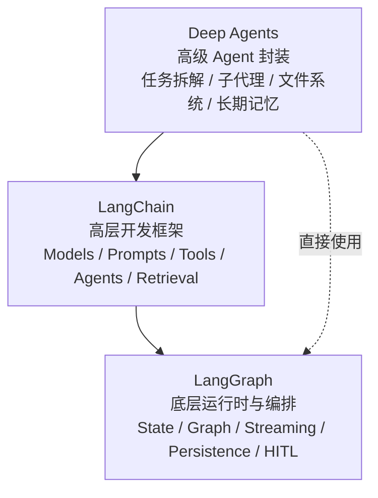
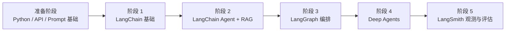

# LangChain Learning Path

更新时间：2026-04-13

这份文档面向想系统学习 `LangChain`、`LangGraph` 和 `Deep Agents` 的开发者，目标不是只看概念，而是按一条清晰路径，从“会调用模型”走到“能做复杂、多步骤、可观测、可恢复的 Agent 系统”。

## 1. 先讲清楚三者关系

可以先把这三个看成同一生态里的三层：



更准确一点：

- `LangGraph` 是最底层的运行时与编排框架，负责状态、流程、持久化、流式执行、人工介入、长任务恢复等能力。
- `LangChain` 是更高层的开发框架，提供模型接口、工具调用、Agent 抽象、检索、结构化输出等常用积木。
- `Deep Agents` 是更高层的“agent harness”，内建了规划、子代理、上下文压缩、文件系统和长期记忆等能力，适合复杂任务。

官方文档里的定位也基本一致：

- `LangChain` 官方建议：普通 Agent 场景可以先从 `Deep Agents` 或 `LangChain` 开始。
- `LangChain agents` 是构建在 `LangGraph` 之上的。
- `Deep Agents` 构建在 `LangChain` 的 agent 核心积木之上，并使用 `LangGraph` 作为运行时。

一句话理解：

- 想快速做 Agent：先学 `LangChain`
- 想掌控复杂流程和状态机：学 `LangGraph`
- 想做更强的复杂任务代理：再看 `Deep Agents`

## 2. 推荐学习顺序

虽然从架构上看是：

```text
LangGraph -> LangChain -> Deep Agents
```

但从学习效率看，更推荐：

```text
LangChain -> LangGraph -> Deep Agents
```

原因很简单：

- `LangChain` 上手最快，能先建立对模型、工具、消息、Agent 的直觉。
- `LangGraph` 更偏底层，没有前面的 Agent 经验，容易一上来就被状态图和运行时细节劝退。
- `Deep Agents` 适合放在后面学，这时候你已经理解为什么需要子代理、上下文隔离、长期记忆和复杂任务拆解。

## 3. 学习路线总览



建议按 5 个阶段推进。时间可以压缩或拉长，但顺序最好不要乱。

## 4. 分阶段学习路径

### 阶段 0：准备阶段

目标：补齐最小前置知识，不在基础问题上卡住。

你至少需要：

- Python 基础：函数、类、异步、虚拟环境、包管理
- HTTP/API 基础：知道什么是 API key、请求、响应、JSON
- Prompt 基础：system、user、assistant 的区别
- LLM 基础：知道模型、tokens、上下文窗口、工具调用是什么
- 检索基础：知道 embeddings、vector store、retriever 的基本概念

完成标准：

- 能用 Python 调一个模型 API
- 能读懂一段包含 `messages` 和 `tools` 的简单示例代码

### 阶段 1：LangChain 基础

目标：学会用 `LangChain` 的核心抽象快速搭建简单应用。

重点学习内容：

- `Models`
- `Messages`
- `Prompts`
- `Tools`
- `Structured output`
- `Streaming`
- `Short-term memory`
- `Middleware`

这阶段要建立的核心认知：

- 模型不是“黑盒聊天”，而是一个可以被标准化调用的推理组件
- Tool calling 是 Agent 的基础
- Message state 是后面工作流和记忆系统的核心载体
- 结构化输出是把“能聊”变成“能接系统”

建议练手项目：

1. 做一个最小聊天助手
2. 做一个带天气查询工具的 Agent
3. 做一个能输出 JSON 的信息抽取器

完成标准：

- 能用 `create_agent` 做一个带工具的 Agent
- 能让模型稳定输出结构化结果
- 能理解一段 LangChain Agent 的输入输出长什么样

### 阶段 2：LangChain Agent + RAG

目标：从“会调 Agent”升级到“会做真实业务原型”。

重点学习内容：

- `Agents`
- `Retrieval`
- `Guardrails`
- `Human-in-the-loop`
- `Long-term memory` 的基本概念
- `LangSmith` 基础观测

这阶段最关键的是理解两类常见系统：

- Tool-using Agent
- Retrieval-augmented application，也就是 `RAG`

建议练手项目：

1. 基于本地文档或知识库做一个问答机器人
2. 做一个“搜索 + 总结 + 引用来源”的研究助手
3. 做一个“用户确认后再执行”的半自动 Agent

完成标准：

- 能独立做一个基础 RAG Demo
- 能追踪 Agent 一次调用里到底用了哪些工具
- 能识别 prompt 问题、工具选择问题和检索问题

### 阶段 3：LangGraph 编排

目标：从“会用 Agent”升级到“会设计复杂工作流和运行时”。

重点学习内容：

- `StateGraph`
- `Nodes` / `Edges`
- `MessagesState`
- `Persistence`
- `Durable execution`
- `Interrupts`
- `Streaming`
- `Memory`
- `Subgraphs`

这阶段你要理解的不是“再做一个聊天机器人”，而是：

- 如何把复杂任务拆成多个确定性步骤
- 哪些步骤适合 Agent，哪些步骤适合普通函数
- 如何在失败后恢复执行
- 如何在中途让人类审批或修正状态

建议练手项目：

1. 做一个“检索 -> 分析 -> 总结 -> 审核”的研究工作流
2. 做一个支持人工审批的内容生成流程
3. 做一个可恢复执行的多步骤数据处理 Agent

完成标准：

- 能解释为什么某个系统需要 `LangGraph` 而不是只用 `LangChain`
- 能设计一个有状态、有中断点、有恢复能力的图工作流
- 能定位某个节点、某段状态或某次中断出了什么问题

### 阶段 4：Deep Agents

目标：学习官方更高阶的复杂 Agent 封装方式。

重点学习内容：

- `create_deep_agent`
- `Subagents`
- `Context engineering`
- `Permissions`
- `Memory`
- `Skills`
- `Sandboxes`
- `Streaming`
- 文件系统上下文管理

这阶段最重要的认知变化是：

- 不再只是“一个 Agent + 几个工具”
- 而是“一个协调者 + 多个子代理 + 上下文隔离 + 更复杂的任务分配”

建议练手项目：

1. 做一个代码库研究助手
2. 做一个多步骤信息搜集与整理助手
3. 做一个需要长上下文管理的复杂任务代理

完成标准：

- 能说明 Deep Agents 相比普通 LangChain Agent 多了什么
- 能判断什么时候适合上子代理，什么时候只是增加复杂度
- 能把一个复杂任务拆成 coordinator + worker 的模式

### 阶段 5：LangSmith 观测、评估与生产化

目标：把“能跑”提升到“可调试、可评估、可持续迭代”。

重点学习内容：

- Tracing
- Observability
- Evaluation
- Prompt iteration
- Regression checking
- Deployment 基本思路

这阶段是很多人最容易忽视、但实际最重要的一段。

如果没有观测和评估：

- 你不知道 Agent 为什么做错
- 你不知道改 prompt 后到底变好了还是变坏了
- 你没法把 Demo 推进到稳定产品

建议练手项目：

1. 给前面做过的 Agent 全部接上 tracing
2. 为一个 RAG 应用设计简单评估集
3. 为一个多步骤工作流建立回归检查机制

完成标准：

- 能通过 trace 看懂一次完整执行链路
- 能定义最基本的评估指标
- 能持续迭代而不是“玄学调 prompt”

## 5. 一条更实用的学习节奏

如果你希望按 6 周左右推进，可以参考这个节奏：

### 第 1 周

- 搞懂 `LangChain` 的模型、消息、工具、结构化输出
- 做一个最小工具调用 Agent

### 第 2 周

- 学 `LangChain Agent`
- 做一个简单 RAG 项目
- 接入 `LangSmith` 看 trace

### 第 3 周

- 学 `LangGraph` 的 `StateGraph`
- 自己画出一个两到四步的小工作流

### 第 4 周

- 学 `Persistence`、`Interrupts`、`Memory`
- 做一个支持人工审批的工作流

### 第 5 周

- 学 `Deep Agents`
- 把前面的复杂任务改造成子代理协作模式

### 第 6 周

- 补 `LangSmith` 评估和观测
- 回头重构前面做过的一个项目，让它更稳定、更可解释

## 6. 每阶段该看什么，不该陷进去什么

### 先看什么

- 官方 overview 和 quickstart
- 官方核心概念页
- 官方示例代码
- 每学完一个概念，就做一个最小可运行 Demo

### 先别陷进去什么

- 一上来就追求多代理系统
- 一上来就追求“自动化所有事情”
- 没有 tracing 就疯狂调 prompt
- 没做过小项目就直接上生产级编排

一个很常见的误区是：看到 `Deep Agents` 很强，就直接跳过去。这样通常会学得很虚，因为你不知道它替你封装了什么，也不知道什么时候不该用它。

## 7. 适合你的选择建议

如果你当前目标是：

### 想快速上手，先做出东西

先学：

- `LangChain`
- `LangSmith` 基础 tracing

### 想做复杂流程、审批、恢复执行、长任务

重点学：

- `LangGraph`
- `LangSmith`

### 想做更强的复杂 Agent，例如任务拆解、子代理协作、长上下文任务

再学：

- `Deep Agents`

## 8. 推荐的项目进阶路线

可以按下面这个顺序做项目，难度会比较平滑：

1. 天气查询 Agent
2. 本地文档问答 RAG
3. 搜索 + 分析 + 汇总的研究助手
4. 支持人工审批的 LangGraph 工作流
5. 基于 Deep Agents 的复杂任务助手

如果你把这 5 个项目做下来，基本就不只是“学过”，而是真的有了 LangChain 生态的实战能力。

## 9. 官方资源入口

建议优先看官方文档，不要一开始就被零散教程带偏。

- LangChain Overview: <https://docs.langchain.com/oss/python/langchain/overview>
- LangGraph Overview: <https://docs.langchain.com/oss/python/langgraph/overview>
- Deep Agents Overview: <https://docs.langchain.com/oss/python/deepagents/overview>
- LangSmith: <https://docs.langchain.com/langsmith/home>
- LangChain Academy: <https://academy.langchain.com/>

## 10. 最后的建议

最好的学习顺序不是“把所有文档看完”，而是：

1. 先用 `LangChain` 做出一个最小 Agent
2. 再用 `LangChain + RAG` 做一个真实一点的应用
3. 再用 `LangGraph` 理解复杂工作流为什么需要状态和恢复能力
4. 最后再用 `Deep Agents` 理解高级 Agent 封装到底帮你省了什么

记住一句话：

`LangChain` 帮你快速搭起来，`LangGraph` 帮你把系统做扎实，`Deep Agents` 帮你把复杂任务做得更强。
